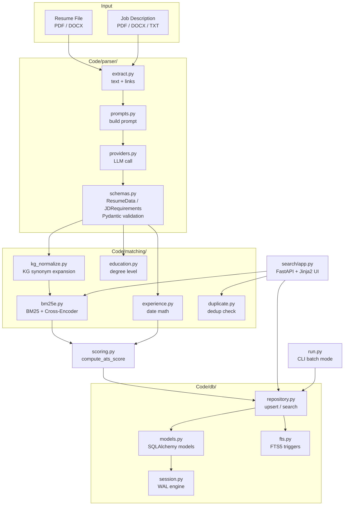
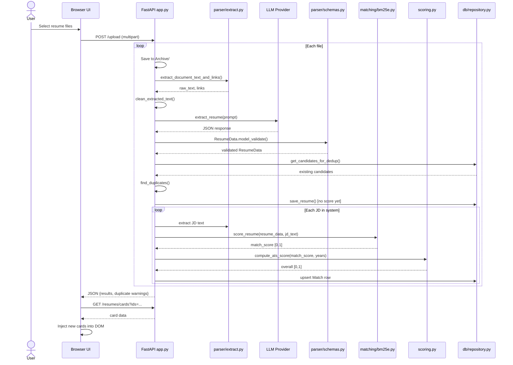
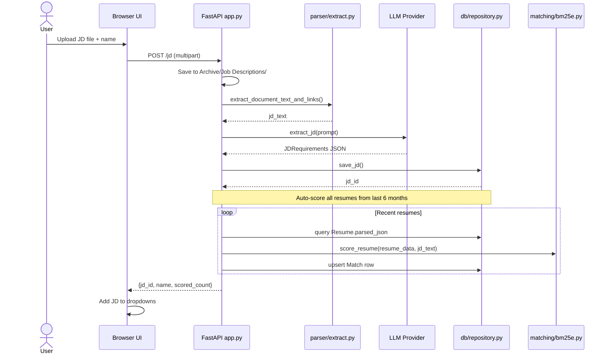
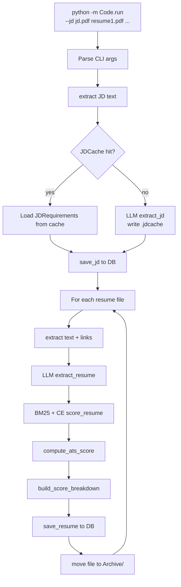
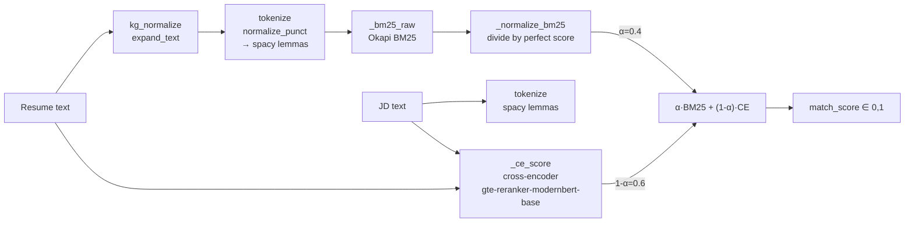
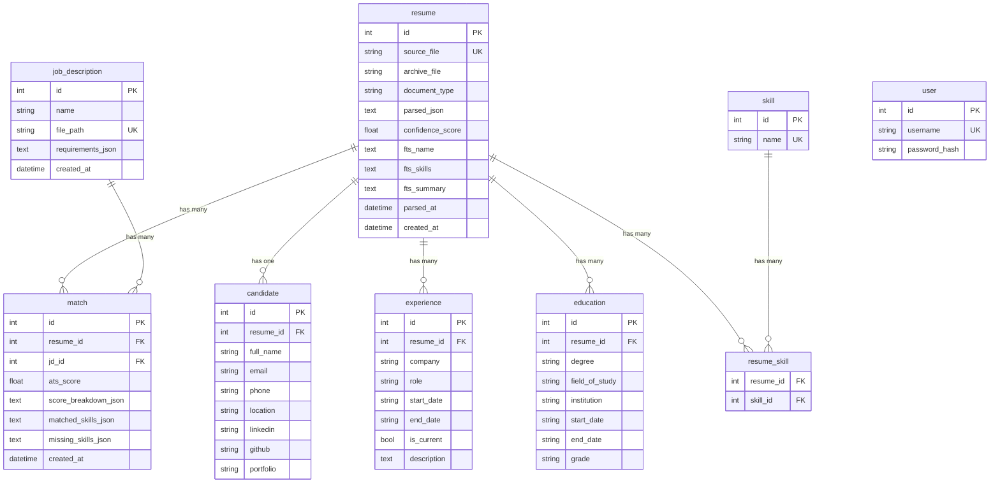
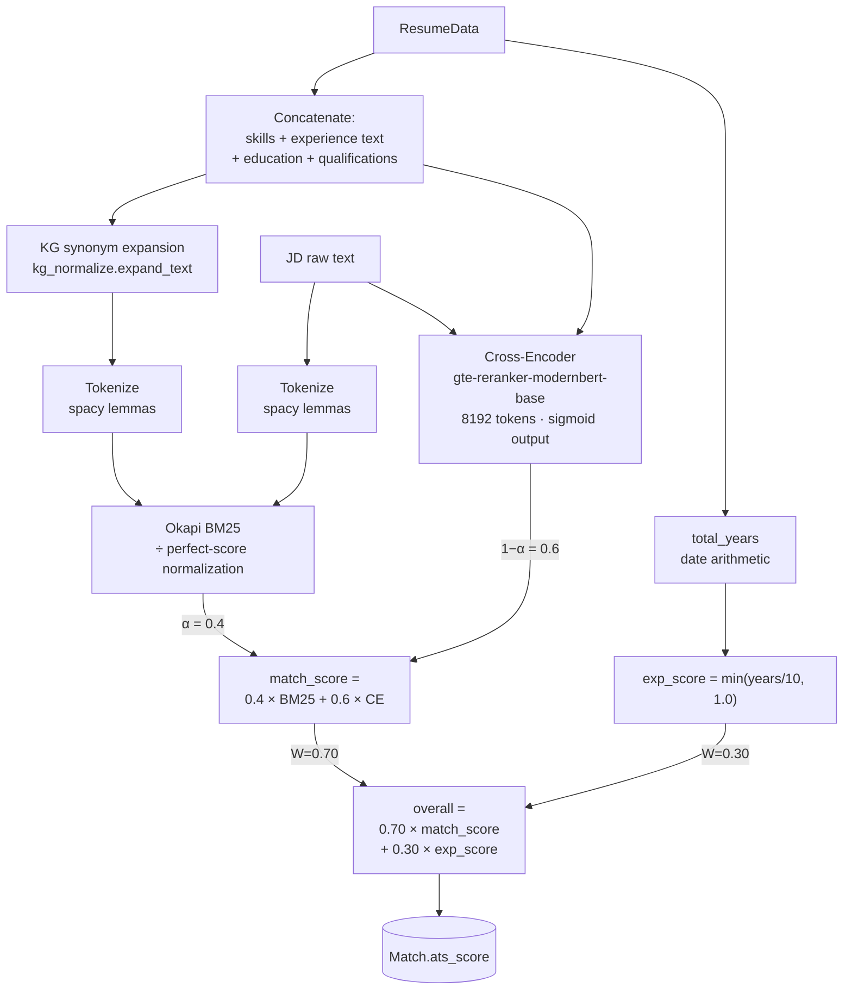
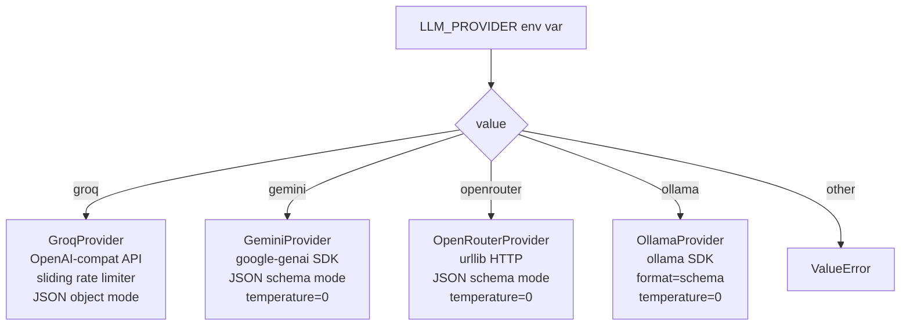

# Resume Parser — Technical Documentation

## Table of Contents

1. [Overview](#1-overview)
2. [Architecture](#2-architecture)
3. [Project Structure](#3-project-structure)
4. [Installation & Configuration](#4-installation--configuration)
5. [Data Flow](#5-data-flow)
6. [Module Reference](#6-module-reference)
   - 6.1 [parser/schemas.py](#61-parserschemaspy)
   - 6.2 [parser/extract.py](#62-parserextractpy)
   - 6.3 [parser/prompts.py](#63-parserpromptspy)
   - 6.4 [parser/providers.py](#64-parserproviderspy)
   - 6.5 [matching/bm25e.py](#65-matchingbm25epy)
   - 6.6 [matching/kg_normalize.py](#66-matchingkg_normalizepy)
   - 6.7 [matching/corpus.py](#67-matchingcorpuspy)
   - 6.8 [matching/experience.py](#68-matchingexperiencepy)
   - 6.9 [matching/education.py](#69-matchingeducationpy)
   - 6.10 [matching/duplicate.py](#610-matchingduplicatepy)
   - 6.11 [scoring.py](#611-scoringpy)
   - 6.12 [db/models.py](#612-dbmodelspy)
   - 6.13 [db/session.py](#613-dbsessionpy)
   - 6.14 [db/fts.py](#614-dbftspy)
   - 6.15 [db/repository.py](#615-dbrepositorypy)
   - 6.16 [search/app.py](#616-searchapppy)
   - 6.17 [run.py](#617-runpy)
7. [Database Schema](#7-database-schema)
8. [Scoring Algorithm](#8-scoring-algorithm)
9. [LLM Providers](#9-llm-providers)
10. [API Reference](#10-api-reference)
11. [Environment Variables](#11-environment-variables)
12. [Running the System](#12-running-the-system)
13. [Testing](#13-testing)

---

## 1. Overview

Resume Parser is a local, self-hosted applicant tracking system (ATS). It performs two functions:

- **Parsing** — Extracts structured information from resume files (PDF, DOCX) and job description documents using a large language model.
- **Ranking** — Scores each resume against each job description using a hybrid BM25 + Cross-Encoder algorithm, producing a deterministic, auditable score that is independent of the LLM.

### Key design principles

| Principle | Implementation |
|---|---|
| LLM does extraction only | One LLM call per document; no scoring in the prompt |
| Scoring is deterministic | Same inputs always produce the same score; no LLM involvement |
| Provider-agnostic | Gemini, Ollama, OpenRouter, Groq selectable via env var |
| Local-first | SQLite + WAL, no cloud services required at runtime |
| Searchable | FTS5 full-text search over names, skills, summaries |

---

## 2. Architecture

> **Diagram location:** below — Mermaid flowchart of the high-level system.



### Component responsibilities

| Component | Responsibility |
|---|---|
| `parser/` | Text extraction, LLM prompt construction, provider abstraction, Pydantic schema validation |
| `matching/` | Hybrid BM25+CE scoring, KG expansion, experience date math, education level check, duplicate detection |
| `scoring.py` | Combines match score and years of experience into a single ATS score |
| `db/` | SQLAlchemy models, WAL SQLite session, FTS5 virtual table, upsert/search helpers |
| `search/app.py` | FastAPI web UI — upload, search, view, delete, re-score |
| `run.py` | CLI batch processor for bulk ingestion |

---

## 3. Project Structure

```
Resume Parser/
├── Code/
│   ├── parser/
│   │   ├── schemas.py        # Pydantic models: ResumeData, JDRequirements
│   │   ├── extract.py        # PDF/DOCX text extraction, OCR fallback
│   │   ├── prompts.py        # LLM prompt builders
│   │   └── providers.py      # LLMProvider protocol + 4 implementations
│   ├── matching/
│   │   ├── bm25e.py          # Hybrid BM25 + Cross-Encoder scorer
│   │   ├── kg_normalize.py   # Knowledge-graph synonym expansion
│   │   ├── corpus.py         # IDF weight loader
│   │   ├── experience.py     # Date-arithmetic years calculation
│   │   ├── education.py      # Degree-level comparison + cert check
│   │   └── duplicate.py      # Candidate deduplication
│   ├── db/
│   │   ├── models.py         # SQLAlchemy 2.0 declarative models
│   │   ├── session.py        # Engine (WAL), SessionLocal, init_db()
│   │   ├── fts.py            # FTS5 virtual table + sync triggers
│   │   └── repository.py     # save_resume, save_jd, search_resumes, …
│   ├── search/
│   │   ├── app.py            # FastAPI application
│   │   └── templates/        # Jinja2 HTML templates
│   │       ├── login.html    # Login page (standalone, no base.html)
│   │       ├── base.html     # Shared layout (nav + CSS variables)
│   │       ├── index.html    # Main candidate cards page
│   │       └── resume.html   # Candidate detail view
│   ├── tests/
│   │   ├── conftest.py
│   │   ├── test_matching.py  # 37 matching unit tests
│   │   ├── test_scoring.py   # 13 scoring unit tests
│   │   └── test_db.py        # 8 DB integration tests
│   ├── scoring.py            # ATS score formula
│   └── run.py                # CLI batch processor
├── Data/
│   ├── idf_weights.json      # Corpus IDF weights for BM25
│   └── kg_expansions.json    # KG synonym map (117k entries)
├── Archive/
│   ├── Job Descriptions/     # Archived JD files
│   └── *.pdf / *.docx        # Archived resume files
├── JDCache/
│   └── *.jdcache             # SHA-256-keyed JD extraction cache
├── requirements.txt
└── DOCUMENTATION.md
```

---

## 4. Installation & Configuration

### Prerequisites

- Python 3.10+
- Tesseract OCR (for scanned PDF fallback): install and set `TESSERACT_CMD` env var on Windows
- spaCy model: `python -m spacy download en_core_web_sm` (run once after install)
- An API key for at least one LLM provider (see [§9](#9-llm-providers))

### Install dependencies

```bash
pip install -r requirements.txt
python -m spacy download en_core_web_sm
```

### Environment file

Create a `.env` file at the project root:

```dotenv
# MySQL database
MYSQL_HOST=localhost
MYSQL_PORT=3306
MYSQL_USER=root
MYSQL_PASSWORD=yourpassword
MYSQL_DB=resume_parser

# Required: pick one LLM provider
LLM_PROVIDER=groq          # groq | gemini | openrouter | ollama

# Groq
GROQ_API_KEY=gsk_...
GROQ_MODEL=openai/gpt-oss-20b          # optional override

# OpenRouter
OPENROUTER_API_KEY=sk-or-...
OPENROUTER_MODEL=openrouter/owl-alpha  # optional override

# Gemini
GENAI_API_KEY=AIza...
GEMINI_MODEL=gemini-2.5-flash-lite     # optional override

# Ollama
OLLAMA_MODEL=gpt-oss:120b-cloud        # optional override
OLLAMA_HOST=http://localhost:11434     # optional, defaults to localhost

# Web UI authentication
SECRET_KEY=change-me-to-a-random-string   # session signing key

# Windows Tesseract path (only needed for scanned PDFs)
TESSERACT_CMD=C:\Program Files\Tesseract-OCR\tesseract.exe
```

---

## 5. Data Flow

### 5.1 Resume upload (via UI)

> **Diagram location:** below — Mermaid sequence diagram for `POST /upload`.



### 5.2 Job description upload (via UI)

> **Diagram location:** below — Mermaid sequence diagram for `POST /jd`.



### 5.3 CLI batch flow

> **Diagram location:** below — Mermaid flowchart for `python -m Code.run`.



---

## 6. Module Reference

### 6.1 `parser/schemas.py`

Pydantic v2 models used as the LLM output contract and the internal data representation.

#### `Candidate`
| Field | Type | Description |
|---|---|---|
| `full_name` | `str \| None` | Candidate's name as printed on the resume |
| `email` | `str \| None` | Primary email address |
| `phone` | `str \| None` | Phone number with country code if shown |
| `location` | `str \| None` | City / state / country |
| `linkedin` | `str \| None` | LinkedIn profile URL |
| `github` | `str \| None` | GitHub profile URL |
| `portfolio` | `str \| None` | Personal website or portfolio |

#### `Experience`
| Field | Type | Description |
|---|---|---|
| `company` | `str \| None` | Employer name (location suffix stripped automatically) |
| `role` | `str \| None` | Job title |
| `start_date` | `str \| None` | `YYYY-MM` or `YYYY` |
| `end_date` | `str \| None` | `YYYY-MM` or `YYYY`; `null` for current roles |
| `is_current` | `bool` | True if resume says Present / Ongoing |
| `description` | `str \| None` | 1–3 sentence synthesized summary of the role |

Date strings are normalized from common formats (`Jan 2020`, `01/2020`) on validation. "Present"/"Current" values in `end_date` are coerced to `null` with `is_current=True`.

#### `Education`
| Field | Type | Notes |
|---|---|---|
| `degree` | `str \| None` | Verbatim degree title |
| `field_of_study` | `str \| None` | Major / specialization |
| `institution` | `str \| None` | School name (location suffix stripped) |
| `start_date` | `str \| None` | `YYYY-MM` or `YYYY` |
| `end_date` | `str \| None` | Graduation date |
| `grade` | `str \| None` | GPA, percentage, or honors |

When start date == end date (graduation-only date), start is set to `null`.

#### `ResumeData`
Top-level extraction schema. Key fields:

| Field | Type | Notes |
|---|---|---|
| `candidate` | `Candidate` | Contact info |
| `summary` | `str \| None` | Verbatim professional summary |
| `skills` | `List[str]` | All skills; MS-prefix aliases canonicalized; cert overlap removed; case-folded deduped |
| `experience` | `List[Experience]` | Chronological roles |
| `education` | `List[Education]` | All degrees |
| `certifications` | `List[str]` | Named certifications and licenses |
| `achievements` | `List[str]` | Awards, honors, recognition |
| `languages` | `List[str]` | Spoken/written languages |
| `qualifications` | `List[str]` | 3–8 word demonstrated-capability phrases (soft skills, domain expertise) |
| `projects` | `List[Project]` | Side/personal projects |
| `parser_metadata` | `ParserMetadata` | Confidence score, missing fields, issues |
| `parsed_at` | `datetime` | Set by server; excluded from LLM schema |

The `model_json_schema()` override strips `parsed_at` so the LLM is never asked to fill it.

#### `JDRequirements`
| Field | Type | Notes |
|---|---|---|
| `required_skills` | `List[str]` | Must-have skills |
| `preferred_skills` | `List[str]` | Nice-to-have skills |
| `min_years_experience` | `float \| None` | Normalized from "3-5 years" → 3.0 |
| `required_education_level` | `str \| None` | One of: `high school`, `associate`, `bachelor`, `master`, `phd` |
| `required_certifications` | `List[str]` | Must-have certs |
| `preferred_certifications` | `List[str]` | Optional certs |
| `required_qualifications` | `List[str]` | Soft-skill / domain requirements |
| `preferred_qualifications` | `List[str]` | Preferred soft-skill requirements |

---

### 6.2 `parser/extract.py`

Handles all document I/O. No LLM involvement.

#### `extract_document_text_and_links(path) → (str, list[str])`
Dispatcher: routes to `_extract_pdf`, `_extract_docx`, or `_read_txt` based on suffix.

#### `extract_pdf_text_and_links(path) → (str, list[str])`
Uses PyMuPDF (`fitz`) to extract text and hyperlinks. Falls back to `extract_pdf_text_with_ocr` if fewer than 50 characters are returned (scanned PDF).

#### `extract_pdf_text_with_ocr(path) → (str, list[str])`
Renders each PDF page at 300 DPI via PyMuPDF, runs Tesseract OCR on the image. Returns combined text and an empty links list (OCR cannot recover hyperlinks).

#### `extract_docx_text_and_links(path) → (str, list[str])`
Uses `python-docx` to walk paragraphs, tables, and hyperlink relationships.

#### `clean_extracted_text(text) → str`
- NFKC Unicode normalization (collapses ligatures, fullwidth chars)
- Strips mojibake characters (common PDF encoding artifacts)
- Strips dingbat/decorative bullet characters (U+2700–U+27BF) before the text reaches the LLM

---

### 6.3 `parser/prompts.py`

#### `build_resume_extraction_prompt(text, extracted_links) → str`
Constructs the full LLM prompt for resume extraction. The prompt includes:
- The target JSON schema (from `ResumeData.model_json_schema()`)
- Section-to-field mapping rules
- Contact field extraction rules (email, phone, location label lists)
- Experience entry rules (role anchoring, undated block handling)
- Skill entry rules (parenthesized list splitting, generic-verb filter)
- Education date normalization rules
- Certification-vs-skill routing rules
- Qualification extraction rules (evidence-grounded only; no skill rephrasing)
- Parser metadata self-check rules

#### `build_jd_extraction_prompt(text) → str`
Constructs the LLM prompt for job description extraction. Rules cover:
- Required vs preferred skill split
- Years normalization ("3-5 years" → 3.0)
- Education level canonicalization
- Certification routing
- Qualification phrase format

---

### 6.4 `parser/providers.py`

#### `LLMProvider` (Protocol)
```python
class LLMProvider(Protocol):
    def extract_resume(self, prompt: str) -> ResumeData: ...
    def extract_jd(self, prompt: str) -> JDRequirements: ...
```

#### `get_provider() → LLMProvider`
Reads `LLM_PROVIDER` env var and returns the matching provider instance. Raises `ValueError` for unknown values.

#### `_retry_validate(call_once, label, prompt, model_cls, expected_keys)`
Shared retry/validation wrapper used by all providers:
1. Call the LLM once, parse JSON, validate against Pydantic model
2. On failure: send a corrective prompt asking the LLM to fix its output
3. On second failure: raise `ValueError`

Also handles response unwrapping — if the LLM wraps the object in an envelope key (e.g. `{"resume": {...}}`), the inner object is extracted automatically.

#### `_SlidingRateLimiter`
Thread-safe sliding-window rate limiter used by `GroqProvider`. Tracks:
- Requests per minute (RPM)
- Requests per day (RPD)
- Tokens per minute (TPM)
- Tokens per day (TPD)

All limits are env-overridable (`GROQ_RPM`, `GROQ_RPD`, `GROQ_TPM`, `GROQ_TPD`).

#### `load_or_extract_jd(jd_file_path, provider, archive_dir, cache_dir) → JDRequirements`
JD extraction with content-hash caching:
1. Compute SHA-256 of the JD file
2. Check `JDCache/<filename>.jdcache` for a matching hash
3. On hit: return cached `JDRequirements` without calling the LLM
4. On miss: call LLM, write cache file, optionally copy JD to archive
5. On hash conflict (same filename, different content): raise `RuntimeError` with instructions

---

### 6.5 `matching/bm25e.py`

Hybrid scorer combining BM25 (lexical) and a cross-encoder (semantic).

> **Diagram location:** below — Mermaid flowchart of the scoring pipeline.



#### `tokenize(text) → list[str]`
1. `normalize_punct(text.lower())` — preserves tech terms like `c++`, `c#`, `.net`
2. Strip all remaining punctuation
3. spaCy `en_core_web_sm`: remove stopwords, lemmatize
4. Drop tokens of length ≤ 1

#### `_bm25_raw(query_tokens, doc_tokens, idf, k1=1.5, b=0.75, avgdl=150) → float`
Okapi BM25 formula. `idf` values come from the LinkedIn corpus (`Data/idf_weights.json`); unknown terms fall back to `idf=1.0`.

#### `_normalize_bm25(raw, query_tokens, idf) → float`
Divides raw BM25 by the theoretical maximum score a perfect document would achieve. Returns a value in [0, 1].

#### `_ce_score(jd_text, resume_text) → float`
Cross-encoder scoring using `Alibaba-NLP/gte-reranker-modernbert-base`:
- 8192-token context window (ModernBERT architecture, trained for long documents)
- Full resume text is passed without truncation — no token budget management needed
- Applies sigmoid to the raw logit: `1 / (1 + e^−x)`
- LoCo long-document retrieval benchmark score: 90.68; ~300 MB on disk; Apache 2.0

#### `score_section(section_text, jd_text, idf, alpha=0.4, use_kg=False) → float`
`alpha·BM25 + (1-alpha)·CE`

KG expansion is applied to the BM25 document side only; the raw text is passed to the cross-encoder unchanged.

#### `score_resume(resume: ResumeData, jd_raw_text: str) → float`
Concatenates skills, experience (role + company + description), education, and qualifications into a single document string, then calls `score_section` with `use_kg=True`.

#### `matched_terms(resume_text, jd_text) → (list[str], list[str])`
Returns `(matched_jd_terms, missing_jd_terms)` by comparing the lemmatized token sets of the two texts. Used to populate the matched/missing skill display in the UI.

Both spaCy and the cross-encoder model are loaded lazily on first use and cached module-level.

---

### 6.6 `matching/kg_normalize.py`

Knowledge-graph synonym expansion for BM25 inputs.

#### `load_expansions() → dict[str, list[str]]`
Loads `Data/kg_expansions.json` once at module level. The file contains 117,354 entries sourced from ESCO (skills ontology), O*NET (occupational knowledge), and ConceptNet (filtered to `/r/Synonym`, `/r/RelatedTo`, `/r/IsA`).

#### `expand_text(text) → str`
Longest-match scan over 1–3 gram windows. For each recognized phrase, appends its synonyms/related terms to the text. Deduplicates expansions.

Example: `"die casting"` → appends `"casting process manufacturing high pressure"`.

#### `normalize_punct(text) → str`
Preserves tech terms containing punctuation that would otherwise be stripped (`c++` → `cpp`, `c#` → `csharp`, `.net` → `dotnet`, etc.) before the BM25 punctuation-stripping step.

---

### 6.7 `matching/corpus.py`

#### `load_idf() → dict[str, float]`
Loads `Data/idf_weights.json` with module-level caching. Returns an empty dict (uniform IDF=1.0) if the file is absent — the scorer degrades gracefully but ranks are less discriminative.

The IDF weights were built from the LinkedIn Job Postings 2023–24 dataset using the script `(deleted) Scripts/build_idf.py`. To rebuild: download the Kaggle dataset, compute smooth IDF over the corpus, write `Data/idf_weights.json`.

---

### 6.8 `matching/experience.py`

#### `total_years(experience_entries) → float`
1. Parses `start_date` and `end_date` strings (`YYYY-MM` or `YYYY`)
2. Treats `is_current=True` as today's date
3. Merges overlapping intervals (e.g., two concurrent jobs don't double-count)
4. Sums non-overlapping months and converts to years (float)

Uses only the standard library — no `dateutil` dependency.

#### `meets_min_experience(experience, min_years) → (bool, float)`
Returns `(meets, actual_years)`. If `min_years` is `None`, always returns `(True, actual_years)`.

---

### 6.9 `matching/education.py`

#### `DEGREE_LEVELS`
```python
{"high school": 1, "associate": 2, "bachelor": 3, "master": 4, "phd": 5}
```

#### `meets_requirement(education_entries, required_level) → (bool, str)`
Keyword-scans each degree string to determine its level. Handles:
- Indian degree formats: `B. Tech.` → `b.tech.` via `_SPACE_DOT` regex collapsing
- No-dot variants: `btech`, `mtech`
- Degree order: PhD → master → bachelor → associate → high school (highest wins)

Returns `(meets_requirement, matched_degree_string)`.

#### `check_certifications(resume_certs, required_certs) → (bool, list, list)`
Substring matching in both directions (JD cert in resume cert string, or vice versa). Returns `(all_met, matched, missing)`.

---

### 6.10 `matching/duplicate.py`

#### `find_duplicates(name, phone, email, existing) → list[DuplicateMatch]`
Three-signal deduplication against existing DB candidates:

| Signal | Method | Threshold |
|---|---|---|
| Email | Exact match (case-insensitive) | — |
| Phone | Strip country code (+1/+91, 10/11/12 digits) then exact | — |
| Name | RapidFuzz `token_sort_ratio` | ≥ 92 |

Name fuzzy match is only applied when neither email nor phone matched the same record. Results are sorted by match count descending.

---

### 6.11 `scoring.py`

#### `compute_ats_score(match_score, years_experience) → float`

```
overall = 0.70 × match_score + 0.30 × min(years / 10.0, 1.0)
```

- `match_score` is the hybrid BM25+CE score from `bm25e.score_resume()`, in [0, 1]
- Experience is capped at 10 years (= 1.0); linear ramp below
- Both weights and the cap are module-level constants (`W_MATCH`, `W_EXP`, `EXP_CAP`) for easy tuning

#### `build_score_breakdown(...) → dict`
Returns a 6-key dict stored in `Match.score_breakdown_json`:
```json
{
  "overall": 0.4823,
  "match_score": 0.5104,
  "years_experience": 6.9,
  "meets_experience": true,
  "education_met": false,
  "certifications_met": true
}
```

---

### 6.12 `db/models.py`

SQLAlchemy 2.0 declarative models. All foreign keys use `ondelete="CASCADE"` so a single SQL `DELETE` cascades to all child tables automatically.

> **Diagram location:** [§7 Database Schema](#7-database-schema) — Mermaid ERD.

| Table | Key columns | Notes |
|---|---|---|
| `job_description` | `id`, `name`, `file_path` (unique), `requirements_json` | Requirements stored as serialized `JDRequirements` JSON |
| `resume` | `id`, `source_file` (unique), `archive_file`, `parsed_json`, `fts_name/skills/summary`, `status` | `fts_*` columns denormalized for text search; `status` is `shortlisted/interviewed/selected/rejected/null` |
| `candidate` | `id`, `resume_id` (1:1 FK) | Contact info split out for indexed queries |
| `skill` | `id`, `name` (unique, lowercase) | Normalized skill vocabulary |
| `resume_skill` | `resume_id`, `skill_id` | Many-to-many join table |
| `experience` | `id`, `resume_id` FK | One row per role |
| `education` | `id`, `resume_id` FK | One row per degree |
| `match` | `id`, `resume_id` FK, `jd_id` FK | Unique on `(resume_id, jd_id)`; stores `ats_score`, breakdown, matched/missing terms |
| `user` | `id`, `username` (unique), `password_hash` | Web UI login credentials; SHA-256 hashed passwords |

---

### 6.13 `db/session.py`

#### Engine configuration
Connects to MySQL via PyMySQL. URL is assembled from env vars (or `DATABASE_URL` for a full override):

```python
mysql+pymysql://<MYSQL_USER>:<MYSQL_PASSWORD>@<MYSQL_HOST>:<MYSQL_PORT>/<MYSQL_DB>?charset=utf8mb4
```

#### `init_db()`
1. `Base.metadata.create_all(engine)` — creates all tables (idempotent)
2. `fts.init_fts(engine)` — sets up LIKE-based text search
3. Seeds a default `user` row (`admin` / `admin123`) if the `user` table is empty

#### `check_password(plain, hashed) → bool`
Compares `sha256(plain)` against the stored hash. Used by the `/login` route.

#### `get_db()` context manager
Yields a `Session`. Rolls back on exception, always closes. Usage:
```python
with get_db() as session:
    ...
```

---

### 6.14 `db/fts.py`

Provides text search over candidate names, skills, and summaries using MySQL LIKE queries.

#### `init_fts(engine)`
Idempotent setup. Drops the legacy SQLite FTS5 index if present (no-op on MySQL).

#### `fts_search(session, query) → list[int]`
Splits the query into terms and builds an AND-across-terms, OR-across-columns LIKE filter:

```sql
(fts_name ILIKE '%term%' OR fts_skills ILIKE '%term%' OR fts_summary ILIKE '%term%')
AND ...
```

Returns matching resume IDs. MySQL's native LIKE was chosen over FULLTEXT because FULLTEXT silently drops short tokens like "AI", "ML", "C#" and has a noisy stopword list that filters common technical terms.

---

### 6.15 `db/repository.py`

#### `save_resume(session, resume_data, source_file, archive_file, score_breakdown, jd_id, matched_skills, missing_skills) → Resume`
Full upsert on `source_file`:
1. Insert or update `resume` row
2. Delete and re-insert `candidate`, `experience`, `education` child rows
3. Rebuild `resume_skill` association rows (upsert `skill` vocabulary)
4. Upsert `match` row if `score_breakdown` + `jd_id` are provided

#### `save_jd(session, name, file_path, requirements) → JobDescription`
Upsert on `file_path`. Serializes `JDRequirements` to JSON.

#### `search_resumes(session, query, min_score, jd_id, min_years, ids) → list[dict]`
Composable filter chain:
1. Optional FTS pre-filter (name / skills / summary text search)
2. Optional ID list filter
3. Per-resume: fetch best `Match` row (filtered by `jd_id` if given, else highest score)
4. Apply `min_score` and `min_years` post-filters
5. Sort by `ats_score` descending

#### `get_resume_by_id(session, resume_id, jd_id) → dict | None`
Returns full detail dict for the resume detail view, including parsed JSON, candidate info, and best match breakdown.

#### `get_all_jds(session) → list[JobDescription]`
Returns all JDs ordered by most recently created.

#### `get_candidates_for_dedup(session) → list[dict]`
Returns minimal `{name, email, phone, source_file}` records for all candidates.

---

### 6.16 `search/app.py`

FastAPI application. All routes serve HTML (Jinja2) except the JSON API endpoints.

#### Startup
`init_db()` is called on startup — creates tables, seeds the default user if the `user` table is empty, and pre-loads the spaCy model and cross-encoder so the first upload or re-score request is fast.

#### Authentication
All routes except `/login` are protected by `_AuthMiddleware` (a `BaseHTTPMiddleware` subclass). HTML requests from unauthenticated clients are redirected to `/login`; JSON/API requests receive a `401 Unauthorized` response.

Session state is maintained via a signed cookie (`SessionMiddleware` from Starlette, key from `SECRET_KEY` env var). The `itsdangerous` package (a Starlette `SessionMiddleware` dependency) must be installed — it is included in `requirements.txt`.

| Route | Description |
|---|---|
| `GET /login` | Renders the login form. Redirects to `/` if already authenticated. |
| `POST /login` | Verifies credentials against the `user` table (`sha256` hash comparison). Sets `session["authenticated"] = True` on success. |
| `GET /logout` | Clears the session and redirects to `/login`. |

#### Managing credentials

Run these directly in MySQL (no app restart needed — changes take effect on the next login attempt):

```sql
-- Add a user
INSERT INTO user (username, password_hash)
VALUES ('newuser', SHA2('yourpassword', 256));

-- Change a password
UPDATE user SET password_hash = SHA2('newpassword', 256) WHERE username = 'admin';

-- Remove a user
DELETE FROM user WHERE username = 'newuser';
```

#### Templates
- `login.html` — Standalone login page with username/password form; supports light/dark theme
- `index.html` — Main page: candidate cards, filter bar, Add Resumes overlay, Add/Manage JDs overlay, dark-mode toggle, "Sign out" link in header. Self-contained (does not extend `base.html`).
- `resume.html` — Candidate detail: score card, matched/missing skill pills, experience timeline, education, certifications, projects
- `base.html` — Shared layout with CSS custom properties for light/dark theming (used by `resume.html`)

#### Branding & color scheme
The UI uses the Groz brand identity:
- **Logo** — `Code/search/images/MicrosoftTeams-image.png` served at `/images/`; displayed at 200 px wide in the header with no background container (the image carries its own black background).
- **Accent color** — Groz orange `#f47920` (hover `#d46010`); used for buttons, focus rings, active badges.
- **Nav / header** — always `#000000` in both themes so the logo sits flush.
- **Light mode** — page background `#f4f4f4`, card surfaces `#ffffff`, borders `#e0e0e0`, dark text.
- **Dark mode** — page background `#000000`, card surfaces `#181818`, borders `#2a2a2a` (no orange outlines on cards or inputs), light text `#f0ece6`.

#### Avatar rendering
Deterministic pastel background + dark text color from candidate name hash (`_avatar_color`). Two-letter initials via `_initials`. Both registered as Jinja2 filters.

---

### 6.17 `run.py`

CLI batch processor. Accepts files or directories as arguments.

```bash
python -m Code.run --jd path/to/jd.pdf path/to/resume1.pdf path/to/resume2.pdf
# or pass a directory:
python -m Code.run --jd path/to/jd.pdf path/to/resumes/
```

Flow per resume:
1. Extract text + links
2. LLM extraction → `ResumeData`
3. Score against JD text (BM25+CE)
4. Compute ATS score
5. Upsert to DB with `save_resume()`
6. Move file to `Archive/`

The JD is LLM-extracted only once per unique file content (SHA-256 cache in `JDCache/`). If the cache file already exists with a matching hash, the LLM call is skipped entirely.

---

## 7. Database Schema

> **Diagram location:** below — Mermaid entity-relationship diagram.



---

## 8. Scoring Algorithm

> **Diagram location:** below — Mermaid flowchart of the full scoring pipeline.



### Score components

| Component | Weight | Range | Source |
|---|---|---|---|
| BM25 match | 40% of match_score | [0, 1] | Lexical overlap with corpus IDF weights |
| Cross-encoder | 60% of match_score | [0, 1] | Semantic relevance via `gte-reranker-modernbert-base` (8192-token, full text) |
| Experience | 30% of overall | [0, 1] | Years / 10, capped at 1.0 |
| Content match | 70% of overall | [0, 1] | BM25+CE match_score |

### Boolean indicators (displayed but do not affect score)

| Flag | Computation |
|---|---|
| `meets_experience` | `total_years >= jd.min_years_experience` |
| `education_met` | Highest degree level ≥ required level |
| `certifications_met` | All required certs found via substring match |

---

## 9. LLM Providers

> **Diagram location:** below — Mermaid flowchart of provider selection.



### Provider configuration

#### Groq
| Env var | Default | Purpose |
|---|---|---|
| `GROQ_API_KEY` | — | Required |
| `GROQ_MODEL` | `openai/gpt-oss-20b` | Model name |
| `GROQ_API_URL` | Groq chat completions | Override for proxies |
| `GROQ_TIMEOUT_SECONDS` | `180` | Per-request timeout |
| `GROQ_MAX_TOKENS` | `4096` | Max completion tokens |
| `GROQ_RPM` | `30` | Rate limit: requests/minute |
| `GROQ_RPD` | `1000` | Rate limit: requests/day |
| `GROQ_TPM` | `8000` | Rate limit: tokens/minute |
| `GROQ_TPD` | `200000` | Rate limit: tokens/day |
| `GROQ_REASONING_EFFORT` | `low` | Reasoning budget (`low`/`high`/`none`) |

Groq includes a sliding-window rate limiter that backs off automatically on 429 responses.

#### OpenRouter
| Env var | Default | Purpose |
|---|---|---|
| `OPENROUTER_API_KEY` | — | Required |
| `OPENROUTER_MODEL` | `openrouter/owl-alpha` | Model name |
| `OPENROUTER_TIMEOUT_SECONDS` | `180` | Per-request timeout |
| `OPENROUTER_MAX_TOKENS` | `4096` | Max completion tokens |
| `OPENROUTER_HTTP_REFERER` | — | Optional referer header |
| `OPENROUTER_APP_TITLE` | — | Optional app title header |

Uses structured output (`json_schema` response format) with the full Pydantic schema.

#### Gemini
| Env var | Default | Purpose |
|---|---|---|
| `GENAI_API_KEY` | — | Required |
| `GEMINI_MODEL` | `gemini-2.5-flash-lite` | Model name |

Uses `google-genai` SDK with `response_schema=ResumeData` for native structured output.

#### Ollama
| Env var | Default | Purpose |
|---|---|---|
| `OLLAMA_MODEL` | `gpt-oss:120b-cloud` | Model name |
| `OLLAMA_HOST` | `http://localhost:11434` | Ollama server URL |
| `OLLAMA_NUM_CTX` | `8192` | Context window tokens |
| `OLLAMA_NUM_PREDICT` | `4096` | Max generated tokens |

---

## 10. API Reference

All routes are served by `uvicorn Code.search.app:app`.

### Authentication routes

| Method | Path | Description |
|---|---|---|
| `GET` | `/login` | Login page. Redirects to `/` if already authenticated. |
| `POST` | `/login` | Submit credentials (`username`, `password` form fields). Redirects to `/` on success, re-renders form with error on failure. |
| `GET` | `/logout` | Clears session and redirects to `/login`. |

All other routes require an authenticated session. Unauthenticated HTML requests are redirected to `/login`; unauthenticated API requests receive `401 Unauthorized`.

### HTML routes

| Method | Path | Description |
|---|---|---|
| `GET` | `/` | Main page — candidate cards, filter bar, overlays |
| `GET` | `/?jd_id=<n>` | Main page filtered to a specific JD's scores |
| `GET` | `/resume/{id}` | Candidate detail page |
| `GET` | `/resume/{id}?jd_id=<n>` | Detail page with scores for a specific JD |

### File serving

| Method | Path | Description |
|---|---|---|
| `GET` | `/file/{resume_id}` | Serve the archived resume file (inline PDF / DOCX download) |

### JSON API

| Method | Path | Request | Response |
|---|---|---|---|
| `POST` | `/upload` | `multipart/form-data`: `files[]` (PDF/DOCX) | `{results: [{filename, status, candidate_name, resume_id, duplicates}]}` |
| `POST` | `/jd` | `multipart/form-data`: `file` (PDF/DOCX/TXT), `name` (str) | `{jd_id, name, scored_count}` |
| `GET` | `/resumes/cards?ids=1,2,3` | Query string | `{results: [card_data...]}` |
| `POST` | `/resumes/rescore` | `{ids: [int], jd_id: int}` | `{results: [{resume_id, score}]}` |
| `DELETE` | `/resumes` | `{ids: [int]}` | `{deleted: [int]}` |
| `DELETE` | `/jds` | `{ids: [int]}` | `{deleted: [int]}` |

### Delete cascade behavior
- Deleting a resume: DB cascade removes `candidate`, `experience`, `education`, `match`, `resume_skill` rows; FTS5 trigger removes the FTS entry; archive file is unlinked from disk.
- Deleting a JD: DB cascade removes all `match` rows for that JD; JD file and `.jdcache` file are unlinked from disk.

---

## 11. Environment Variables

Complete reference table.

| Variable | Module | Default | Required |
|---|---|---|---|
| `MYSQL_HOST` | session.py | `localhost` | No |
| `MYSQL_PORT` | session.py | `3306` | No |
| `MYSQL_USER` | session.py | `root` | No |
| `MYSQL_PASSWORD` | session.py | _(empty)_ | No |
| `MYSQL_DB` | session.py | `resume_parser` | No |
| `DATABASE_URL` | session.py | — | No (overrides all MYSQL_* vars) |
| `SECRET_KEY` | app.py | `rp-secret-change-me` | Yes (for production) |
| `LLM_PROVIDER` | providers.py | `openrouter` | No |
| `GROQ_API_KEY` | providers.py | — | If using Groq |
| `GROQ_MODEL` | providers.py | `openai/gpt-oss-20b` | No |
| `GROQ_API_URL` | providers.py | Groq endpoint | No |
| `GROQ_TIMEOUT_SECONDS` | providers.py | `180` | No |
| `GROQ_MAX_TOKENS` | providers.py | `4096` | No |
| `GROQ_RPM` | providers.py | `30` | No |
| `GROQ_RPD` | providers.py | `1000` | No |
| `GROQ_TPM` | providers.py | `8000` | No |
| `GROQ_TPD` | providers.py | `200000` | No |
| `GROQ_REASONING_EFFORT` | providers.py | `low` | No |
| `OPENROUTER_API_KEY` | providers.py | — | If using OpenRouter |
| `OPENROUTER_MODEL` | providers.py | `openrouter/owl-alpha` | No |
| `OPENROUTER_TIMEOUT_SECONDS` | providers.py | `180` | No |
| `OPENROUTER_MAX_TOKENS` | providers.py | `4096` | No |
| `OPENROUTER_HTTP_REFERER` | providers.py | — | No |
| `OPENROUTER_APP_TITLE` | providers.py | — | No |
| `GENAI_API_KEY` | providers.py | — | If using Gemini |
| `GEMINI_MODEL` | providers.py | `gemini-2.5-flash-lite` | No |
| `OLLAMA_MODEL` | providers.py | `gpt-oss:120b-cloud` | No |
| `OLLAMA_HOST` | providers.py | `http://localhost:11434` | No |
| `OLLAMA_NUM_CTX` | providers.py | `8192` | No |
| `OLLAMA_NUM_PREDICT` | providers.py | `4096` | No |
| `TESSERACT_CMD` | extract.py | System PATH | No (Windows) |

---

## 12. Running the System

### Start the web UI

```bash
uvicorn Code.search.app:app --host 0.0.0.0 --port 8000
```

Then open `http://localhost:8000` in a browser.

On first startup, `init_db()` creates all MySQL tables and seeds a default login (`admin` / `admin123`).

### Using the UI

0. **Sign in** — Enter your username and password on the login page. Click "Sign out" in the top-right nav to end the session.
1. **Add a Job Description** — Click "Add / Manage JDs" → upload PDF/DOCX/TXT → give it a name. All resumes from the last 6 months are automatically re-scored against the new JD.
2. **Add Resumes** — Click "Add Resumes" → select one or more PDF/DOCX files from anywhere on your machine. Each file is parsed by the LLM and scored against all JDs in the system. Duplicate candidates are flagged.
3. **Search & Filter** — Use the search bar (free-text over name, skills, summary), minimum score slider, and minimum years filter. Select a JD from the dropdown to switch which JD's scores are displayed.
4. **View a Candidate** — Click any candidate card to see the full detail view: score breakdown, matched/missing terms, experience, education, certifications, projects.
5. **View Original File** — Click "View File" on any card to open the archived PDF or download the DOCX.
6. **Re-score** — Select resumes using checkboxes → choose a JD → click "Re-score" to recompute scores without re-parsing.
7. **Delete** — Select one or more resumes → click "Delete selected". Both the DB record and the archived file are removed.

### CLI batch mode

```bash
# Single JD, multiple resumes
python -m Code.run --jd "path/to/Die Casting JD.pdf" "path/to/resumes/"

# Single JD, explicit files
python -m Code.run --jd jd.txt resume1.pdf resume2.docx resume3.pdf
```

Output:
```
JD: Die Casting JD.pdf  (5 resume(s))
  Processing Mr. Ankesh.pdf... [done] Ankesh Kumar  (14.2s, score=0.427)
  Processing Mr. Devashish Roy.pdf... [done] Devashish Roy  (13.8s, score=0.381)
  ...
Done. 5 resume(s) processed.
```

The JD is LLM-extracted only on the first run for each unique file. Subsequent runs with the same JD file are instant (cache hit).

---

## 13. Testing

```bash
# Run all tests
python -m pytest Code/tests/ -v

# Run a specific test file
python -m pytest Code/tests/test_matching.py -v
python -m pytest Code/tests/test_scoring.py -v
python -m pytest Code/tests/test_db.py -v
```

Current test count: **66 tests** (37 matching, 13 scoring, 8 DB, 8 other), all passing.

### Test coverage highlights

| Test file | What is covered |
|---|---|
| `test_matching.py` | BM25 formula, tokenizer (stopwords, lemmatization), cosine and CE mocking, KG expansion (unigram, bigram, no-duplicate), experience date math (overlapping intervals), education degree-level, duplicate detection (email/phone/name/multi-signal) |
| `test_scoring.py` | Weight sum, perfect/zero score, known-good hand-calculated result, per-weight isolation, determinism, exp cap, breakdown key set and consistency, rounding |
| `test_db.py` | Table creation, resume insert, resume upsert (same id preserved), JD upsert, match save with score, match upsert, FTS search by skill, `min_score` filter |

### Adding tests

All test files are under `Code/tests/`. The `conftest.py` inserts the project root into `sys.path` so all `Code.*` imports resolve correctly. New tests for DB code should use an in-memory SQLite engine rather than the production database.
